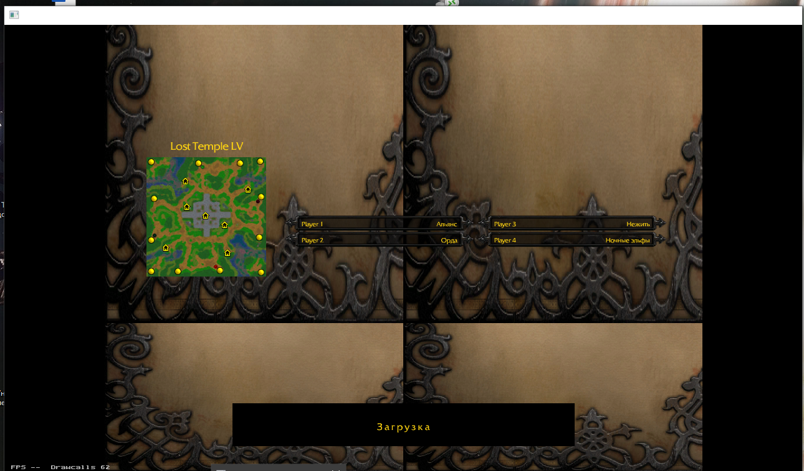
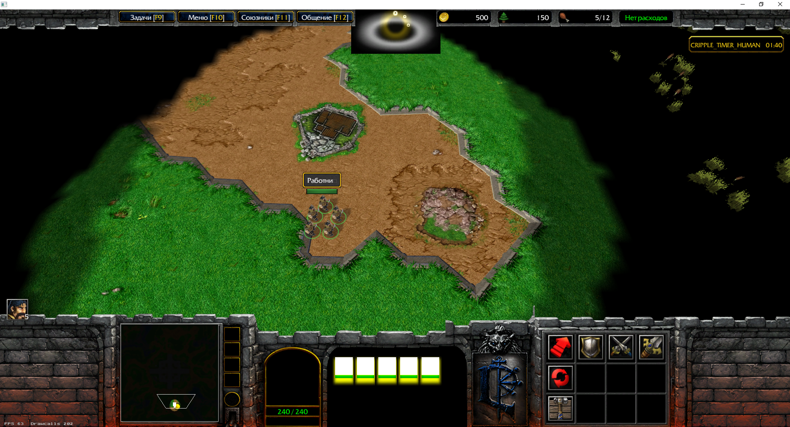

# Warcraft III map tester status

This document records the current state of OpenWarcraft3's map-testing scaffold. It is a development snapshot, not a claim of Warcraft III compatibility. The goal is to build the minimum reliable path for opening Reforged 3.0 maps in Classic graphics, then use it to test the 23-Race-Legion map.

## Current test setup

- Client: OpenWarcraft3, Windows, TFT runtime.
- Game data: Warcraft III Reforged 3.0, loaded from CASC.
- Graphics mode: Classic.
- Map: `Lost Temple LV` from the Season 9 map collection.
- Reference frames below are from the current local run on 2026-09-29.

## Observed state

| Area | Current result |
|---|---|
| Startup and map load | Reaches a playable map session using Reforged CASC data. The loading background is repeated in a 2x2 pattern instead of appearing once. |
| Terrain | Terrain textures and ground shape render. The game camera and fog of war are active. |
| Units | Several worker models appear and can be selected. The screenshot shows five workers and the resource/supply counters. |
| Buildings and resources | The expected Town Hall and Gold Mine are not visibly rendered as recognizable models in the reported run. The object near the starting workers is not confirmed as a correctly rendered Gold Mine. |
| Trees and doodads | Expected trees around the starting area are missing. Some distant shapes in the screenshot are not yet identified as the map's intended doodads. |
| HUD | The classic stone console and several resource/status elements render. The minimap and parts of the unit information panel remain black or incomplete. |
| Orders | The command card is in the expected lower-right area. The user reports missing or unusable order icons; the screenshot alone does not establish that commands work. |

## Screenshots

### Loading screen

The background is visibly tiled four times while the loading text is drawn once.

### In-game frame

Terrain, workers, some HUD elements, and the command card are visible. This frame also shows the missing or incomplete world objects and interface areas described above.

## Minimum tester milestones

1. Load a Reforged CASC installation and a loose `.w3x` map without relying on MPQ-only paths.
2. Render the map's terrain, cliffs, doodad placements, destructables, buildings, and units from their authored data and resolved models.
3. Preserve map player slots and starting placements so a test session has the expected starting forces and resources.
4. Draw the Classic HUD in the expected positions, resolve its textures, and make the order card respond to input.
5. Keep useful bounded diagnostics for unresolved assets and map objects so missing content can be traced without guessing from screenshots.

The current run proves only that the CASC-backed map can reach a visible client session with terrain and some units. It does not yet meet the minimum tester milestones above. The next work should identify the source of the loading-screen tiling and then trace map object placement/model resolution and the command-card input path separately.
